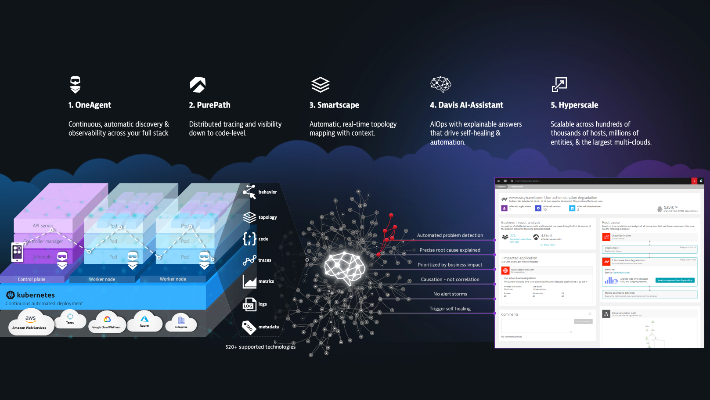
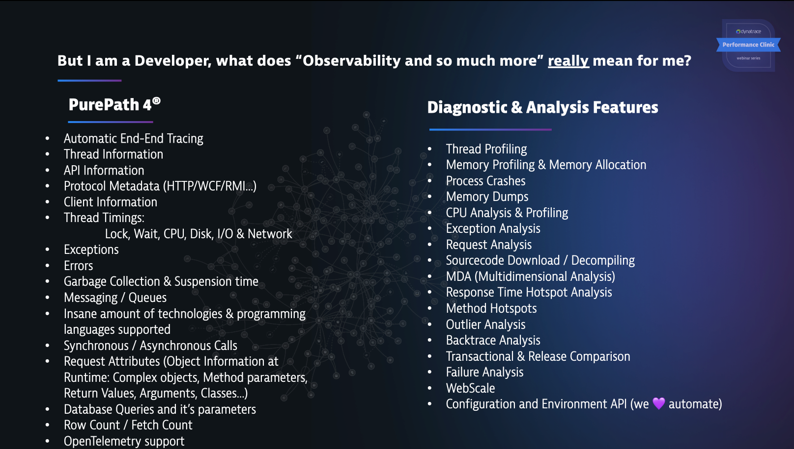
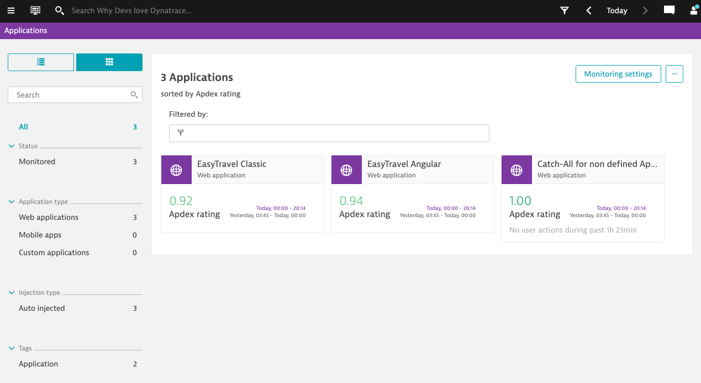

summary: Why Developers Love Dynatrace - Episode 1
id: why-devs-love-dynatrace-1
categories: codelevel, cicd, qualitygates
tags: codelevel
status: Published
authors: sergio.hinojosa

# Why Devs Love Dynatrace - Episode 1

## Agenda

With this Developer Webinar Series we want to bring you from Zero to Hero

<!--TODO create AGENDA -->
Negative
: Episode 1-4 Agenda comes here

<!-- ### TODO Abstract 4 Episodes

### What we’re covering/not covering

 Then we will play the role of an application Tester and test manually the Login/Account REST Endpoints of EasyTravel on the integration system. We will learn how to filter and analyze each distributed transaction up to code level details showing it's impact on each service. We will learn the principles of filters and chain of filters. 
- This is not a product tutorial (although we will demo and show new features of the product)
- We will cover some best practices on Loadtesting and Release comparison so you can apply this in you company and help release better software faster.
- The software optimizations and analysis can be done <a href="https://www.dynatrace.com/support/help/technology-support/supported-technologies-and-versions/" target="_blank">in any technology that Dynatrace can monitor</a> 
- There is no need to be an Azure or Keptn expert and everything we are covering can be applied to ANY environment (e.g. Azure, GCP, Kubernetes, On-Prem, etc…) and any modern CI/CD Pipeline that can be triggered via REST.

- Help you become more comfortable using Dynatrace to diagnose application problems, understand the service dependencies, the architecture and know how and where to optimize.
- Help you diagnose the overall health of an environment from thousands of services all the way to threads, exceptions and response times of a single transaction end-2-end through all layers (FullStack)
- Get Feedback on Transactions for Developers
- Do a Top Down-analysis and Bottom-Up (on single or multiple transactions)
- Understand the added-value for developers to have an automated qualitygate in the CI/CD pipeline.
- Make the diagnosis easy for others in your organization
- Not everybody needs to be a “Dynatrace Expert”
- Understand how you can leverage Davis so she helps you monitor and diagnose applications.
- Understand the value of automatic quality gates with performances as a self-service
- Best Practices for automatic loadtesting and quality gates. How to build SLI/SLOs for continuous release comparison. 
- Integrate, compare and analyze Loadtests with Dynatrace
- Compare and analyze GarbageCollection, Memory Allocation, Survived Objects, ThreadGroups & blocking Threads as well as CPU Utilization for loadtests or any ondemand analysis for that matter.
---->

## Introduction 
Duration: 10

Positive
: As a developer you are asked to create high quality software faster. Fullstack Observability and automated distributed tracing with code level visibility give you all the data you need to analyse and understand response time hotspots, cpu and memory usage, errors and exceptions, service dependencies, synchronization and thread issues, inefficient database calls, problematic libraries or impact of 3rd party components.


>In Episode 1 of this Performance Clinic Series, we will show you hands-on on how you can use Dynatrace in your development & test environments to automate observability and analysis of your applications & services. We will learn how to analyse problematic transactions in complex & hybrid distributed systems. We will dive into easy access of your distributed traces (we call them PurePaths) and how Dynatrace automatically shows the hotspots so that you can easily optimize or fix them.

In Episode 1 we will learn how to:
- Easy start with Dynatrace in Development & Integration environments 
- Analyze big & complex environments
- Enhance Developers FeedBack with distributed tracing and code level insights
- Analyze and identify developer transactions (or any kind of transaction)

## Dynatrace & the OneAgent for Devs in a nutshell
### Dynatrace Secret Sauce
Positive
: 

### Observability and so much more
Positive
: 

### Features for Developers in a nutshell
Positive
: 

## Installing the OneAgent & Easytravel

The environment we want to analyze consists of a booking travel portal with a mix of technologies. A mix of Legacy and Classic Stack and also some new stack running on containers. You just need an ubuntu machine to spin it up. 

Positive
: You have to bring your own Dynatrace tenant. If you don't have a Dynatrace tenant yet, sign up for a [free trial](https://www.dynatrace.com/trial/) or a [developer account](https://www.dynatrace.com/developer/).

### Download install script
>Download help script to install Easytravel, Nginx, Docker the OneAgent and other utils	
```bash
wget https://raw.githubusercontent.com/dynatrace-perfclinics/why-devs-love-dynatrace/main/easytravel/ubuntu-setup-easytravel.sh
```
### Add your Dynatrace credentials
Positive
: We want that the script installs the OneAgent before installing easyTravel and the docker containers. We just need to add the variables at the beginning.

```bash
## Set DT_TENANT_URL and API TOKEN
# ---- Define Dynatrace Environment ----
# Sample: https://{your-domain}/e/{your-environment-id} for managed or https://{your-environment-id}.live.dynatrace.com for SaaS
DT_TENANT_URL=
DT_PAAS_TOKEN=
```
### Execute the script
```bash
sudo bash -c './ubuntu-setup-easytravel.sh &'
```

Positive
: If you want to learn more about how this script is composed and setting up easytravel, it's endpoints and everything that is installed, check out the codelab [Deploying Easytravel @ 127.0.0.1](https://dynatrace-perfclinics.github.io/codelabs/deploy-easytravel-at-localhost) 

## Environment Configuration (MonACo)

Monaco stands for `Monitoring As Code`. In Dynatrace we love to automate. With monaco we can automate the configuration of one or multiple environments following a GitOps approach. 

Positive
: Having an environment where automatically every Host, Process, Namespace, Transaction etc... gets categorized automatically (via automated tagging) is a ver powerful and useful approach that should be used on every DevOps practice. With Dynatrace you can use filters and chain of filters to find the needle in the haystack in a matter of seconds.

We will import the following configurations following a GitOps approach:

- [Management Zones](https://www.dynatrace.com/support/help/how-to-use-dynatrace/management-zones/) 
- [Automated Tagging](https://www.dynatrace.com/support/help/how-to-use-dynatrace/tags-and-metadata/setup/how-to-define-tags/#automated-approach)
- [Request Attributes](https://www.dynatrace.com/support/help/how-to-use-dynatrace/transactions-and-services/basic-concepts/request-attributes/)
- [Dashboards](https://www.dynatrace.com/support/help/how-to-use-dynatrace/dashboards-and-charts/dashboards/create-dashboards/)
- [Application Definition](https://www.dynatrace.com/support/help/how-to-use-dynatrace/real-user-monitoring/setup-and-configuration/web-applications/initial-configuration/define-your-applications-via-the-my-web-application-placeholder/)

### Download Monaco
[Dynatrace Monitoring as Code](https://github.com/dynatrace-oss/dynatrace-monitoring-as-code)

Download the [latest release (depending the architecture of your OS)](https://github.com/dynatrace-oss/dynatrace-monitoring-as-code/releases/latest) and add the binary to your path.

### Check that you can execute the binary
```bash
monaco --help
```
### Clone the GitOps configuration
```bash
git clone https://github.com/dynatrace-perfclinics/why-devs-love-dynatrace
```

### Navigate to the GitOps directory
```bash
cd why-devs-love-dynatrace/monaco/devlove 
```

### Add your variables to a helper script `set_dt_variables.sh`
```bash
vi set_dt_variables.sh
```

```bash
# Sample: https://{your-domain}/e/{your-environment-id} for managed or https://{your-environment-id}.live.dynatrace.com for SaaS
DT_TENANT_URL=
# https://www.dynatrace.com/support/help/shortlink/token#create-an-api-token-
# Token in format dt0c01.STXXXX....
DT_API_TOKEN=

# DT_USER (Your login username in the environment, Click on the top right on the people icon and see your id, it can be your email or a username)
DT_USER=
```

Negative
: The variables will be exported as environment variables.

### Load the variables in the shell
```bash
source set_dt_variables.sh
```
### Execute Monaco

```bash
monaco deploy -e environment.yaml --project episode1 -v
```
##  Diagnosing any Environment 

### Understanding the Performance of any Environment
Positive
: Leveraging automated tagging and management zones you can get very fast and easy an understanding of user experience, transactions, hosts, application network traffic, failures on specific stages, regions, datacenters, namespaces, departments, subcompanies, etc.


In this Performance Overview Dashboard you can see:

- the amount and health of databases, services, hosts and applications.
- amount of requests vs responsetime 95th percentile
- Network status
- HTTP errors and failed transactions
- Database calls and time spent in database per transaction
- most failing services 
- service throughput
- slowest services
- database calls per service
- time transactions spent in database
- service time spent in wait, lock, IO and CPU
- JVM CPU by ThreadGroup
- GC by Poolname
- Memory Allocation Objects by API


Positive
: Click on the Management Filter (Top right) Filter by EasyTravel or BankJob. See how the Dashboard automatically adapts to the entities filtered.

## Deployment overview

For getting a quick understanding on what is deployed on an enviroment, I recommend to start with the following sections:

### Technologies
Positive
: Click on Technologies (either on) te link of the dashboard or expand the left menu > technologies


> In this screenshot your might find more technologies since we have a Developer Kubernetes Cluster deployed from Episode 2.
 
### Applications
Get an understanding on the real users accessing the defined applications.


### Smartscape
Positive
: Get an understanding on the dependencies and all the layers of the deployed & monitored technologies. Hosts running on Datacenters, processes running on hosts, services (transactions) running on each process and users (applications) interacting with those services.


## Basic Diagnostics

### Diagnostic Tools 🔬🩺

[More about Diagnostic Tools](https://www.dynatrace.com/support/help/how-to-use-dynatrace/diagnostics/)


### Top Requests 

Search for:

- Only failed transactions
- Transactions with more than 10 seconds over the last 6 hours
- Transactions calling dynatrace.com 
- Transactions that makes more than 100 database calls.

### Top Database Statements

Search for:

- Do we have failing  database statements?
- Which is the slowest database transaction of the day? **Continue analysing with the outliers** Detect the slowest execution and understand from where was this SQL triggered.
- Which SQL hast the most Fetch count and wich the most Row count? Where is this transaction coming from? Which application and which user action is triggering this SQL?

### Exceptions

Negative
: ⚠️ Exceptions are expensive and can cost unnecessary memory and CPU consumption. Having the ability to sort them by amount, impact and impacted services allows you to assign them to tickets in your backlog. Making your application continuously better.

Search for:

- All Exceptions of the day
- Failed exceptions

Positive
:  Dynatrace has the ability to configure custom error detection for your services. If there is an BusinessException where you want to mark the transation failed so the failurerate increases, you can do this in the <a href="https://www.dynatrace.com/support/help/how-to-use-dynatrace/transactions-and-services/configuration/configure-service-error-detection/" target="_blank">service error detection</a>.


### Let 👧 🧠 DAVIS work for you!

<!--- ----------------------------- ---->

## Developer Feedback and Manual Testing

> Feedback is one of the most important attributes on Software Development. The better, faster and reliable the feedback is, the better will the software be. 

In this section we will see how developers can get feedback on real time from integration or production systems.

**No more "well... it worked on my computer, is operations problem now 🤷‍♂️ "❗️**

<!-- 
FIXME

-->

### REST Sign-In

#### REST Sign-In (Create Account) EasyTravel

We are asked to test the REST Sign-In and Login functionality of  Easytravel. To understand the flow of the transaction, response time and architecture. We are only given the REST Endpoint.

```bash
POST http://{{custom.easytravel_ip}}/easytravel/rest/signin
```

JSON Body
```json
{
    "firstName": "{{custom.developer_name}}",
    "lastName": "{{custom.developer_name}} LastName",
    "email": "{{custom.developer_name}}",
    "password": "{{custom.developer_name}}",
    "state": "Bayern",
    "city": "Munich",
    "street": "Main Street 1",
    "door": "",
    "phone": "+49123456789"
}

```

We are going to pass this attributes into the POST request.
```bash
HTTP Headers:
Content-Type: application/json
x-developer: yourname
```

For this we can use cURL, Postman or any REST tool. Here is an API Test already preconfigured for you <a href="https://apitester.com/shared/checks/961787656e25474a903dd5dd917d7570" target="_blank">🚦 API TEST Template for SingIn</a>


- The test consists of basically 2 steps, POST request and an assert.
- Modify the X-Developer Header with **your_name_identifier**.
- This value will be used as email and password for the creation of the SignIn. (just for keeping things simple)

#### Create an Account via REST
<!-- FIXME

-->

- Click on Test
- It should pass all 4 steps.
- Now, click on „Test„ again. Yes, with the same data. Let‘s try to create the same Sign-In Account. 
- The test should fail. What error code did you get?

### REST Log-In

#### REST Login (Log in to the created account)  EasyTravel


```bash
POST http://{{custom.easytravel_ip}}/easytravel/rest/login
```

JSON Body
```json
{
    "username": "{{custom.developer_name}}",
    "password": "{{custom.developer_name}}"
}
```
#### Login via REST
- Open the test <a href="https://apitester.com/shared/checks/67a53403e464439fb4909b205912267d" target="_blank">🚦 API TEST Template for Login</a>
- Modify the developer name with your_name to the name where you created the account
- Click on Test
- You should have a succesfull test and the reponse returns the entered data from the Account.

### REST Sign-In requests in Dynatrace

#### MDA FeedBack Developer
- Go to MDA and search the request by `{RequestAttribute:Developer}`
- Filter your requests and show the Service-Flow. 
 
 
#### ServiceFlow of the Developer Requests
- Start the flow from the nginx reverse proxy.
- By not filtering the 3 requests (2x signin + 1x login) you’ll see the flow of the 3.


#### Filter by the first correct sign-in
> Let’s analyze first the correct signin.

- Fiter by _HTTP Code 200_ + Request _“sign”_ notice that you don’t need to match the exact name of the request.
- Notice how Dynatrace shows detailed information from every service and inter-tiercalls as DB calls.


#### Response Time Hotspots Sign-In

> Navigate with the Response Time Hotspots all the way to the Database. Follow the services. Notice the detailed information about the SQLs and even the Connection Acquisitions.


#### Difference between the 2 Sign-Ins
Can you notice the difference from the two Sign-in why the second Sign-in failed? That it got an HTTP 403 is obvious. But if you look at the purepaths in detail you’ll notice that the select statement of the first Sign-In did not return any results from the database on the select statement hence it could create an account and subsequently an Insert was done. In the second attempt since there was a result (a row) returned, no Insert statement or new Account was created.

### REST Login requests in Dynatrace


#### Service-flow Login
- Now show the flow of a Login.
- Notice again the intertier-calls how they add up, the contribution of each service and the infrastructure where it’s running.

<!-- 
FIXME

-->

#### ResponseTime Hotspots Login
Open the ResponseTime Hotspots from the ReverseProxy. Notice the contribution from Tomcat the Calls to AuthenticationService (4x) and VerificationService (1x)

Notice the contribution by Method within the AuthenticationService and how it can tell us which method is taking the most time within a single transaction (even though we are moving in 2 digit ms time)

<!--- ----------------------------- ---->